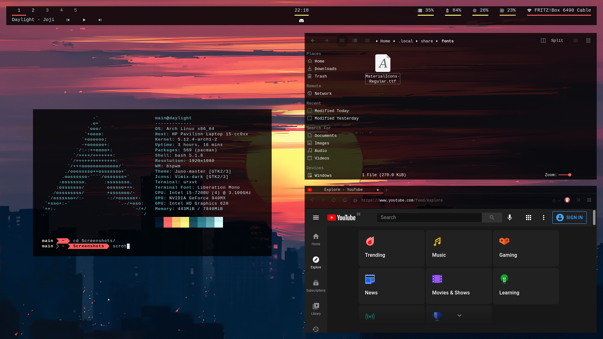
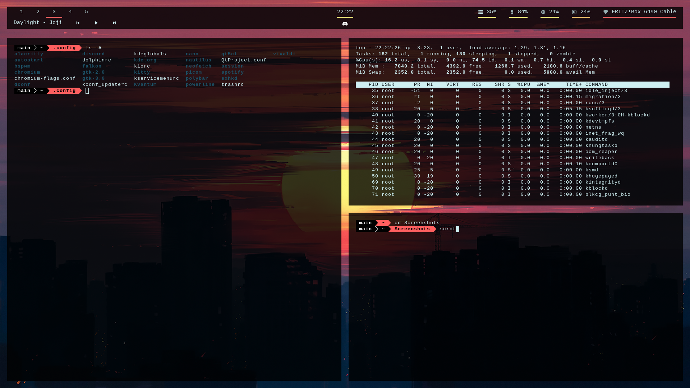

# daylight
daylight is a collection of dotfiles for an arch system configuration
## Preview

## What is configured?
Below you will find a list of each part of the system and where the config files are located:

Part | Config location
------------ | -------------
xinit | `~/.xinitrc`
bspwm | `~/.config/bspwm/bspwmrc`
sxhkd | `~/.config/sxhkd/sxhkdrc`
lightdm | `/etc/lightdm/lightdm.conf`
polybar | `~/polybar/config`, `~/.config/polybar/launch.sh`
bash | `~/.bash_profile`
rxvt-unicode | `~/.Xresources`
powerline | `~/.config/powerline/[...]`
feh | `~/.fehbg`
kvantum, qt5ct | `~/.config/Kvantum/[...]`
dolphin, falkon | (via `kvantummanager`)
dmenu | (flags only, see `bspwm` config)
